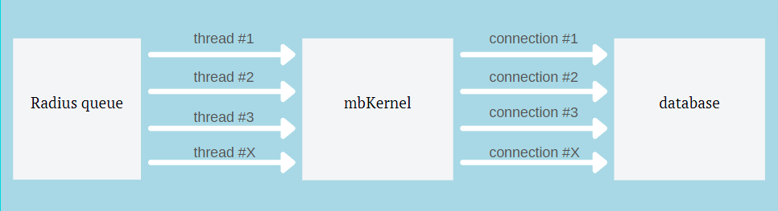

Настройка модуля MBRadius
###########################################

Посмотрим на конфигурацию radius (**radiusd.conf**)

.. container:: toggle

    .. container:: header

        .. raw:: html

            <button>Show/Hide Config</button>

    .. code-block:: bash
      :emphasize-lines: 16-18,58-63
      :linenos:

        prefix = /usr
        exec_prefix = /usr
        sysconfdir = /etc
        localstatedir = /var
        sbindir = /usr/sbin
        logdir = ${localstatedir}/log/radius
        raddbdir = ${sysconfdir}/raddb
        radacctdir = ${logdir}/radacct
        name = radiusd
        confdir = ${raddbdir}
        run_dir = ${localstatedir}/run/${name}
        db_dir = ${raddbdir}
        libdir = /usr/lib/freeradius
        pidfile = ${run_dir}/${name}.pid

        max_request_time = 9
        cleanup_delay = 10
        max_requests = 2097152

        listen {
            type = auth
            ipaddr = *
            port = 0
        }

        listen {
            ipaddr = *
            port = 0
            type = acct
        }

        hostname_lookups = no
        regular_expressions	= yes
        extended_expressions	= yes

        log {
            destination = files
            file = ${logdir}/radius.log
            #requests = ${logdir}/radiusd-%{%{Virtual-Server}:-DEFAULT}-%Y%m%d.log
            syslog_facility = daemon
            stripped_names = no
            auth = no
            auth_badpass = no
            auth_goodpass = no
        }

        checkrad = ${sbindir}/checkrad

        security {
            max_attributes = 3000
            reject_delay = 0
            status_server = yes
        }

        proxy_requests  = off

        thread pool {
            start_servers = 8
            max_servers = 12
            min_spare_servers = 1
            max_spare_servers = 1
            max_requests_per_server = 0
            max_queue_size = 1048576
            auto_limit_acct = no
        }

        modules {
            $INCLUDE ${confdir}/modules/
            $INCLUDE sql.conf
        }

        instantiate {
            expr
        }

        $INCLUDE sites-enabled/

нас интересуют отдельные строки

    .. code-block:: bash

        max_request_time = 9
        cleanup_delay = 10
        max_requests = 2097152

        ...

        thread pool {
            start_servers = 8
            max_servers = 12
            min_spare_servers = 1
            max_spare_servers = 1
            max_requests_per_server = 0
            max_queue_size = 1048576
            auto_limit_acct = no
        }

Рассмотрим эти параметры:

.. glossary::

    max_request_time
        Максимально время за которое модуль mbkerenl должно обработать запрос и вернуть результат

    cleanup_delay
        После получения результата, радиус будет хранить этот "результат" у себя в памяти на случай если результат не дойдет до BRAS сервера и BRAS заново отправит запрос.

    max_requests
        Размер того самого хранилища для результатов, которые радиус будет хранить в памяти пока не очистит

    start_servers
        Начальное кол-во потоков которое будет запущено для обработки запросов авторизации

    max_servers
        Максимальное кол-во потоков которое будет запущено для обработки запросов авторизации

    min_spare_servers
        Не используется в нашем модуле

    max_spare_servers
        Не используется в нашем модуле

    max_requests_per_server
        Максимальное кол-во запросов которое может обработать один поток, после чего он будет перезапущен ( 0 - без ограничения )

    max_queue_size
        Размер очереди для запросов авторизации

    auto_limit_acct
        Ограничение accounting запросов

Теперь посмотрим на изображение ниже

Все полученные запросы радиус помещает в "Radius queue" размер которого зависит от параметра **max_queue_size**,
далее из очереди запросы передаются через потоки к модулю :doc:`mbKernel <../../structure/mbkernel>`,
в свою очередь модуль mbKernel создает соединение с базой на каждый поток радиуса.

**Как подобрать параметры**
*******************************************

.. math:: pps / 20 = threads

1 поток способен обработать до 20-25 запросов в секунду (тесты ниже).
mbKernel автоматически создает дочерний процесс под каждый поток радиуса, по этому на каждом радиус сервере нужно высчитывать его :abbr:`pps (packets/s)` запросов.

Узнать :abbr:`pps (packets/s)` можно с помощью ``tcpdump`` и ``capinfos``:

**Установка софта**
===========================================

``capinfos`` доступен из пакета ``wireshark`` по этому для установки выполним

Для Centos:

.. code-block:: bash

  dnf install tcpdump wireshark

Для Debian:

.. code-block:: bash

  apt-get install tcpdump wireshark

**Определение pps**
===========================================

После установки нужно запустить ``tcpdump`` на принимающем radius запросы интерфейсе с записью в файл

.. code-block:: bash

  tcpdump -i eth1 port 1812 -w /tmp/radius_pps.pcap

Для записи будет достаточно 5-10 минут (что бы успел пройти accounting интервал)

После чего можно посмотреть информацию о записи, выполнив:

.. code-block:: bash

  capinfos /tmp/radius_pps.pcap

В результате будет показана информация:

.. code-block:: bash
      :emphasize-lines: 15
      :linenos:

      File name:           /tmp/radius_pps.pcap
      File type:           Wireshark/tcpdump/... - pcap
      File encapsulation:  Ethernet
      File timestamp precision:  microseconds (6)
      Packet size limit:   file hdr: 262144 bytes
      Number of packets:   985
      File size:           118 kB
      Data size:           102 kB
      Capture duration:    8.437724 seconds
      First packet time:   2021-06-18 18:07:35.578060
      Last packet time:    2021-06-18 18:07:44.015784
      Data byte rate:      12 kBps
      Data bit rate:       97 kbps
      Average packet size: 103.89 bytes
      Average packet rate: 116 packets/s
      SHA256:              ef76dc37e0b4bb74f07ee66305fb9c170a064514ad84342ad134271264af319c
      RIPEMD160:           a1b65b2b63c883ea1a0d862a665044ee8b1666c9
      SHA1:                3782a747440f95a55580b41b40b6f8d78ec5be86
      Strict time order:   True
      Number of interfaces in file: 1
      Interface #0 info:
                     Encapsulation = Ethernet (1 - ether)
                     Capture length = 262144
                     Time precision = microseconds (6)
                     Time ticks per second = 1000000
                     Number of stat entries = 0
                     Number of packets = 985

**Тесты**
*******************************************

.. list-table:: Конфигурация сервера на котром проводились тесты
   :widths: 100 100
   :header-rows: 1

   * - Дата выпуска
     - Q1 2012
   * - CPU
     - 2х Intel(R) Xeon(R) CPU E5-2650 0 @ 2.00GHz
   * - Cores
     - x16
   * - RAM
     - DDR3 16gb
   * - SSD
     - SAMSUNG MZ7KM480HAHP-0E005

**Тест 1: влияние кол-ва потоков радиуса**
===========================================

.. list-table:: Параметры теста
   :widths: 100 100
   :header-rows: 1

   * - Radperf
     - 200 потоков
   * - Кол-во запросов авторизации
     - 10000

Посмотрим график производительности модуля mbKernel

.. chart:: docs/charts/radius_threads_1.json

    Влияние потоков на производительность

.. chart:: docs/charts/radius_queue_1.json

    Влияние потоков на время обработки всех запросов

Как видно на графике, повышение кол-ва потоков увеличивает производительность и сокращается время требуемое на обработки всех запросов

Давайте посмотрим что поисходит с временем затраченным на обработку одного запроса

.. chart:: docs/charts/radius_timings_1.json

    Влияние потоков на время обработки одного запроса

На графике видно как до определенного кол-ва потоков запросы обрабатываются **<1 сек**, после чего довольно резко переходят до **<0.1s**.
Это связано с тем, что запросы некоторое время "ожидают" в очереди радиуса

**Тест 2: максимальная производительность**
===========================================

В данных тестах мы прогоняли от 1000 до **1.000.000** запросов авторизации

.. list-table:: Параметры теста #1
   :widths: 100 100
   :header-rows: 1

   * - Radperf
     - 128 потоков
   * - Радиус
     - 128 потоков
   * - RAM
     - DDR3 16gb

Посмотрим график производительности модуля mbKernel

.. chart:: docs/charts/radius_test_16g_pps.json

    Производительность модуля mbKernel (packets/s)

.. chart:: docs/charts/radius_test_16g_time.json

    Затраченное время на обработку всех запросов

Как видно на графике удалось разогнать packets/s до 2954, на 1.000.000 было замечено падение производительности.

.. list-table:: Параметры теста #2
   :widths: 100 100
   :header-rows: 1

   * - Radperf
     - 256 потоков
   * - Радиус
     - 256 потоков
   * - RAM
     - DDR3 32gb

.. chart:: docs/charts/radius_test_32g_pps.json

    Производительность модуля mbKernel (packets/s)

.. chart:: docs/charts/radius_test_32g_time.json

    Затраченное время на обработку всех запросов

Как видно на графике удалось разогнать packets/s до 4583, на 1.000.000 было замечено падение производительности и более высокая нагрузка на MySQL.

**Заключение**
*******************************************

Логика в настройке радиуса проста: больше потоков => больше производительнось, но не стоит забывать что каждый поток потребляет ресурсы сервера
и если "увлектись" и выставить слишком большое кол-во потоков то можно добиться обратного эффекта снизив производительность.

.. include:: ../../footer_links.rst