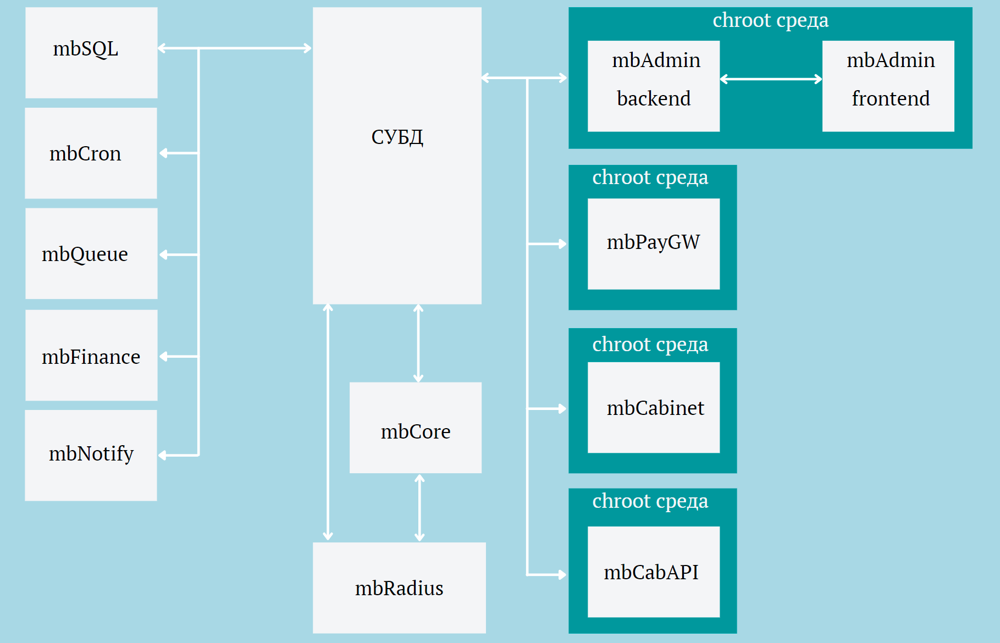

Структура биллинга
###########################################

Логическая структура биллинга

Файловая структура биллинга

.. code-block:: bash

	/var/bill/
	├── backup
	│   ├── mbadmin
	│   ├── mbcabinet
	│   ├── mbcabapi
	│   ├── mbsql
	│   ├── mbcore
	│   ├── mbpaygw
	│   ├── mbcron
	│   ├── mbqueue
	│   └── mbfinance
	├── mrtg
	├── license
	├── logs
	│   ├── mbadmin
	│   ├── mbcabinet
	│   ├── mbcabapi
	│   ├── mbsql
	│   ├── mbcore
	│   ├── mbpaygw
	│   ├── mbcron
	│   ├── mbqueue
	│   └── mbfinance
	├── mbadmin
	│   ├── chroot
	│   │   ├── production
	│   │   └── testing
	│   ├── production
	│   └── testing
	├── mbcabinet
	│   ├── chroot
	│   │   ├── production
	│   │   └── testing
	│   ├── production
	│   └── testing
	├── mbcabapi
	│   ├── chroot
	│   │   ├── production
	│   │   └── testing
	│   ├── production
	│   └── testing
	├── mbsql
	│   ├── production
	│   └── testing
	├── mbcore
	│   ├── production
	│   └── testing
	├── mbpaygw
	│   ├── chroot
	│   │   ├── production
	│   │   └── testing
	│   ├── production
	│   └── testing
	├── mbcron
	│   ├── production
	│   └── testing
	├── mbqueue
	│   ├── production
	│   └── testing
	├── mbfinance
	│   ├── production
	│   └── testing

Описание директорий
*******************************************

.. glossary::

    /var/bill
        Домашняя директория биллинга, тут располагаются файлы модулей

    /var/bill/backup
        Директория для бекапов модулей

    /var/bill/mrtg
        Директория для mrtg графиков

    /var/bill/license
        Директория для файлов лицензии биллинга

    /var/bill/logs
        Директория для логов модулей, каждый лог модуля находится в своей директории с названием модуля

    :doc:`/var/bill/mbadmin <mbadmin>`
        Директория модуля админки, имеет chroot среду и production/testing версии модуля

    :doc:`/var/bill/mbcabapi <mbcabapi>`
        Директория модуля API Личного кабинета пользователей, имеет chroot среду и production/testing версии модуля

    :doc:`/var/bill/mbsql <mbsql>`
        Директория модуля обновления структуры базы данных, имеет production/testing версии модуля

    :doc:`/var/bill/mbcore <mbcore>`
        Директория модуля ядра биллинга, имеет production/testing версии модуля

    :doc:`/var/bill/mbpaygw <mbpaygw>`
        Директория модуля приема платежей, имеет chroot среду и production/testing версии модуля

    :doc:`/var/bill/mbfinance <mbfinance>`
        Директория модуля обработки платежей, имеет production/testing версии модуля

    :doc:`/var/bill/mbcron <mbcron>`
        Директория модуля заданий по расписаню, имеет production/testing версии модуля

    :doc:`/var/bill/mbcabinet <mbcabinet>`
        Директория модуля Личного кабинета пользователей, имеет chroot среду и production/testing версии модуля

    :doc:`/var/bill/mbqueue <mbqueue>`
        Директория модуля выполнений заданий очереди, имеет production/testing версии модуля

.. toctree::
	:hidden:
	:maxdepth: 5
	:titlesonly:

	database
	mbsql
	mbradius
	mbcore
	mbcron
	mbqueue
	mbadmin
	mbpaygw
	mbfinance
	mbcabinet
	mbcabapi

.. include:: ../footer_links.rst
